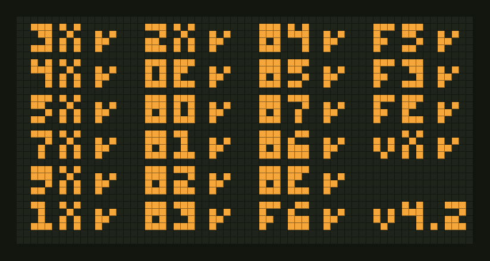

# iron-chip

[](https://github.com/NamanU7/iron-chip/actions/workflows/ci.yml)

A CHIP-8 virtual machine written in Rust — the complete instruction set, with
explicit control over memory, registers, the call stack, timers, input, and
the display. One core, two frontends:

- **Desktop** — a native SDL2 app with vsync'd rendering and a square-wave beep
- **Browser** — the same core compiled to WebAssembly, drawn with WebGL

**▶ [Run it in your browser](https://namanu7.github.io/iron-chip/)** — no install, ROMs included.
Desktop binaries for Linux, macOS, and Windows are on the
[releases page](https://github.com/NamanU7/iron-chip/releases).

<p align="center">
  
</p>
<p align="center"><em>Actual emulator output: the corax+ opcode test, every group passing.</em></p>

## Layout

```
chip8-core/       the virtual machine: fetch/decode/execute, timers, framebuffer.
                  No I/O, no dependencies — pure state machine + unit tests.
desktop/          SDL2 frontend (binary: iron-chip)
web/              wasm-bindgen + WebGL frontend and the demo page
roms/             bundled test ROMs (Timendus' CHIP-8 test suite, GPLv3)
tools/framegrab   run a ROM headless, render the framebuffer to a PNG
```

The screenshots in this README are actual emulator output, generated with:

```bash
cargo run -p framegrab -- roms/timendus/3-corax+.ch8 docs/corax.png 5000
```

The core exposes a deliberately small surface — `step()`, `tick_timers()`,
`key_down()/key_up()`, `display()`, `beeping()` — so a frontend only decides
*when* to run cycles and *how* to draw pixels. That separation is what lets
the identical interpreter run against SDL2 and WebGL.

## Running

### Browser

Use the [hosted demo](https://namanu7.github.io/iron-chip/), or build it
yourself with [wasm-pack](https://rustwasm.github.io/wasm-pack/):

```bash
wasm-pack build web --release --target web --no-typescript
mkdir -p dist/pkg dist/roms
cp web/static/* dist/
cp web/pkg/iron_chip_web.js web/pkg/iron_chip_web_bg.wasm dist/pkg/
cp roms/timendus/*.ch8 dist/roms/
# serve dist/ with any static file server
```

### Desktop

Grab a prebuilt binary from the
[releases page](https://github.com/NamanU7/iron-chip/releases), or build from
source:

```bash
cargo run --release -p iron-chip -- roms/timendus/3-corax+.ch8
```

SDL2 is compiled from source via the `bundled` feature (needs CMake and a C
compiler). Options: `--scale N` for pixel size, `--ipf N` for instructions per
60 Hz frame (default 11 ≈ 700/s). `P` pauses, `Backspace` resets, `Esc` quits.

### Keypad

The CHIP-8's 4×4 hex keypad maps onto the left of your keyboard:

```
CHIP-8          Keyboard
1 2 3 C         1 2 3 4
4 5 6 D    →    Q W E R
7 8 9 E         A S D F
A 0 B F         Z X C V
```

## Tests

```bash
cargo test --workspace
```

Unit tests pin down each instruction's contract — carry/borrow flags, the
`VF`-as-operand edge case, XOR draw with collision, sprite clipping versus
coordinate wrap, `Fx0A` blocking, BCD — and integration tests run the bundled
[Timendus test-suite](https://github.com/Timendus/chip8-test-suite) ROMs
headless through the full decode path.

## Behavior notes

CHIP-8 "quirks" differ across historical interpreters; iron-chip implements
the widely-used modern (SUPER-CHIP-style) conventions:

| Area | Behavior |
|---|---|
| `8xy6` / `8xyE` shifts | operate on `Vx` in place; `VF` = shifted-out bit |
| `Fx55` / `Fx65` | leave `I` unchanged |
| `Bnnn` | jumps to `nnn + V0` |
| `Dxyn` | start coordinates wrap; the sprite clips at display edges |
| `Fx0A` | resolves on key press |

## License

MIT © Naman Uttamchandani. Bundled test ROMs in `roms/timendus/` are from
[Timendus/chip8-test-suite](https://github.com/Timendus/chip8-test-suite),
licensed under GPLv3 (see `roms/timendus/LICENSE`).
